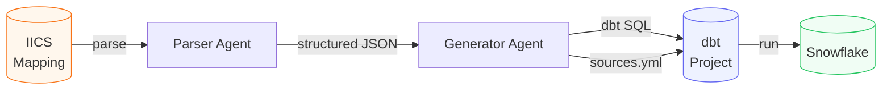
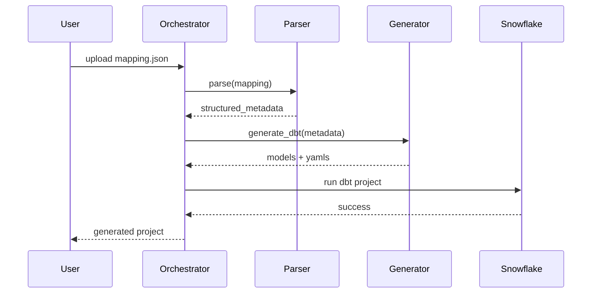
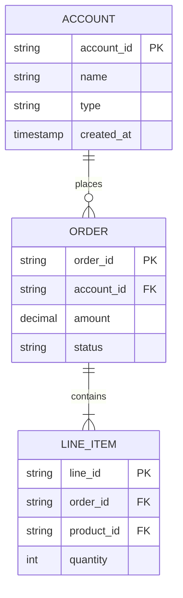
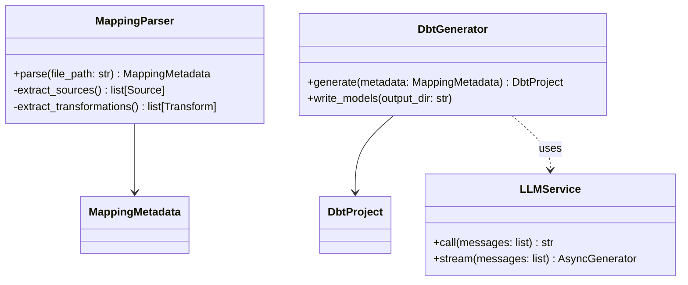
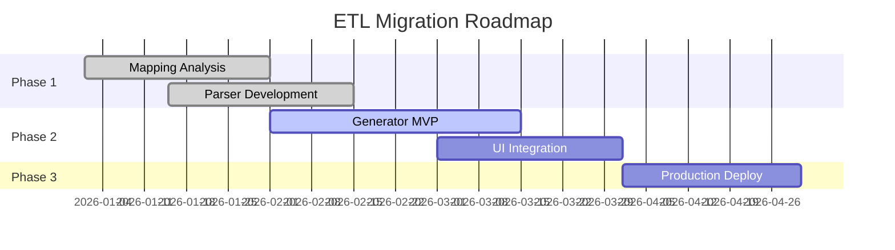

# SVG Diagrams

Generate precise, readable diagrams. Choose the right format for the context, then commit to clean styling.

---

## Format Selection

| Context | Best format |
|---------|-------------|
| Standalone file (.svg) | Native SVG |
| GitHub README / markdown docs | Mermaid (renders natively on GitHub) |
| Presentation / high fidelity | SVG with precise styling |
| Quick inline doc | Mermaid |
| Complex custom layouts | Native SVG |

---

## Native SVG — Patterns & Conventions

### Base Template
```svg
<svg xmlns="http://www.w3.org/2000/svg" viewBox="0 0 800 500" width="800" height="500">
  <defs>
    <!-- Arrowhead marker -->
    <marker id="arrow" markerWidth="10" markerHeight="7" refX="10" refY="3.5" orient="auto">
      <polygon points="0 0, 10 3.5, 0 7" fill="#555"/>
    </marker>
    <!-- Dashed arrow -->
    <marker id="arrow-dashed" markerWidth="10" markerHeight="7" refX="10" refY="3.5" orient="auto">
      <polygon points="0 0, 10 3.5, 0 7" fill="#999"/>
    </marker>
    <!-- Drop shadow filter -->
    <filter id="shadow" x="-5%" y="-5%" width="110%" height="110%">
      <feDropShadow dx="2" dy="2" stdDeviation="3" flood-color="#00000022"/>
    </filter>
  </defs>

  <!-- Background -->
  <rect width="800" height="500" fill="#F8F9FA"/>

  <!-- Title -->
  <text x="400" y="32" text-anchor="middle" font-family="system-ui, sans-serif"
        font-size="16" font-weight="600" fill="#1A1A2E">Diagram Title</text>

  <!-- Content here -->
</svg>
```

### Color Palette (use consistently within a diagram)
```
Boxes:       #EEF2FF (light indigo fill) + #6366F1 (indigo border)
Data stores: #F0FDF4 (light green fill) + #22C55E (green border)
External:    #FFF7ED (light orange fill) + #F97316 (orange border)
Services:    #EFF6FF (light blue fill) + #3B82F6 (blue border)
Warnings:    #FEF2F2 (light red fill) + #EF4444 (red border)
Arrows:      #555555 (solid) / #999999 (dashed, optional/async)
Text:        #1A1A2E (dark) / #6B7280 (muted label)
```

### Reusable Box Component
```svg
<!-- Rounded box with label -->
<g transform="translate(100, 80)">
  <rect width="160" height="60" rx="8" ry="8"
        fill="#EEF2FF" stroke="#6366F1" stroke-width="1.5" filter="url(#shadow)"/>
  <text x="80" y="35" text-anchor="middle"
        font-family="system-ui, sans-serif" font-size="13" font-weight="500" fill="#1A1A2E">
    Component Name
  </text>
</g>
```

### Database / Cylinder
```svg
<g transform="translate(300, 200)">
  <ellipse cx="60" cy="12" rx="60" ry="12" fill="#F0FDF4" stroke="#22C55E" stroke-width="1.5"/>
  <rect x="0" y="12" width="120" height="56" fill="#F0FDF4" stroke="#22C55E" stroke-width="1.5"/>
  <ellipse cx="60" cy="68" rx="60" ry="12" fill="#F0FDF4" stroke="#22C55E" stroke-width="1.5"/>
  <text x="60" y="44" text-anchor="middle"
        font-family="system-ui, sans-serif" font-size="12" fill="#1A1A2E">Database</text>
</g>
```

### Arrow Between Boxes
```svg
<!-- Horizontal arrow: from right edge of box A to left edge of box B -->
<line x1="260" y1="110" x2="340" y2="110"
      stroke="#555" stroke-width="1.5" marker-end="url(#arrow)"/>
<!-- Label on arrow -->
<text x="300" y="105" text-anchor="middle"
      font-family="system-ui, sans-serif" font-size="11" fill="#6B7280">HTTP/JSON</text>

<!-- Dashed arrow (async / optional) -->
<line x1="260" y1="150" x2="340" y2="150"
      stroke="#999" stroke-width="1.5" stroke-dasharray="6,4" marker-end="url(#arrow-dashed)"/>
```

### Swimlane / Layer Background
```svg
<!-- Shaded region to group related components -->
<rect x="20" y="60" width="760" height="120" rx="6"
      fill="#F1F5F9" stroke="#CBD5E1" stroke-width="1" stroke-dasharray="4,3"/>
<text x="30" y="78" font-family="system-ui, sans-serif"
      font-size="11" font-weight="600" fill="#94A3B8" letter-spacing="0.05em">LAYER NAME</text>
```

---

## Mermaid — Embedded Diagrams (GitHub / Markdown)

### Flowchart (left-to-right data pipeline)
````markdown

````

### Sequence Diagram (agent interactions)
````markdown

````

### Entity Relationship
````markdown

````

### Class Diagram (Python architecture)
````markdown

````

### Gantt / Timeline
````markdown

````

---

## Architecture Diagram — Full SVG Example

Data pipeline architecture:

```svg
<svg xmlns="http://www.w3.org/2000/svg" viewBox="0 0 900 420" width="900" height="420">
  <defs>
    <marker id="arr" markerWidth="10" markerHeight="7" refX="10" refY="3.5" orient="auto">
      <polygon points="0 0, 10 3.5, 0 7" fill="#555"/>
    </marker>
    <filter id="sh">
      <feDropShadow dx="1" dy="1" stdDeviation="2" flood-color="#00000018"/>
    </filter>
  </defs>

  <rect width="900" height="420" fill="#F8FAFC"/>

  <!-- Title -->
  <text x="450" y="30" text-anchor="middle" font-family="system-ui,sans-serif"
        font-size="15" font-weight="600" fill="#0F172A">Data Pipeline Architecture</text>

  <!-- Source layer -->
  <rect x="20" y="55" width="160" height="310" rx="6" fill="#FFF7ED" stroke="#FED7AA" stroke-width="1"/>
  <text x="100" y="73" text-anchor="middle" font-family="system-ui,sans-serif"
        font-size="10" font-weight="700" fill="#C2410C" letter-spacing="0.05em">SOURCES</text>

  <!-- Source boxes -->
  <rect x="35" y="85" width="130" height="44" rx="6" fill="#fff" stroke="#F97316" stroke-width="1.5" filter="url(#sh)"/>
  <text x="100" y="112" text-anchor="middle" font-family="system-ui,sans-serif" font-size="12" fill="#1A1A2E">Informatica IICS</text>

  <rect x="35" y="145" width="130" height="44" rx="6" fill="#fff" stroke="#F97316" stroke-width="1.5" filter="url(#sh)"/>
  <text x="100" y="172" text-anchor="middle" font-family="system-ui,sans-serif" font-size="12" fill="#1A1A2E">Salesforce CRM</text>

  <rect x="35" y="205" width="130" height="44" rx="6" fill="#fff" stroke="#F97316" stroke-width="1.5" filter="url(#sh)"/>
  <text x="100" y="232" text-anchor="middle" font-family="system-ui,sans-serif" font-size="12" fill="#1A1A2E">SAP ERP</text>

  <!-- Agent layer -->
  <rect x="210" y="55" width="200" height="310" rx="6" fill="#EEF2FF" stroke="#C7D2FE" stroke-width="1"/>
  <text x="310" y="73" text-anchor="middle" font-family="system-ui,sans-serif"
        font-size="10" font-weight="700" fill="#4338CA" letter-spacing="0.05em">AI AGENTS</text>

  <rect x="225" y="120" width="170" height="50" rx="6" fill="#fff" stroke="#6366F1" stroke-width="1.5" filter="url(#sh)"/>
  <text x="310" y="150" text-anchor="middle" font-family="system-ui,sans-serif" font-size="12" fill="#1A1A2E">Parser Agent</text>

  <rect x="225" y="220" width="170" height="50" rx="6" fill="#fff" stroke="#6366F1" stroke-width="1.5" filter="url(#sh)"/>
  <text x="310" y="250" text-anchor="middle" font-family="system-ui,sans-serif" font-size="12" fill="#1A1A2E">Generator Agent</text>

  <!-- dbt layer -->
  <rect x="440" y="55" width="200" height="310" rx="6" fill="#F0FDF4" stroke="#BBF7D0" stroke-width="1"/>
  <text x="540" y="73" text-anchor="middle" font-family="system-ui,sans-serif"
        font-size="10" font-weight="700" fill="#166534" letter-spacing="0.05em">DBT PROJECT</text>

  <rect x="455" y="100" width="170" height="44" rx="6" fill="#fff" stroke="#22C55E" stroke-width="1.5" filter="url(#sh)"/>
  <text x="540" y="127" text-anchor="middle" font-family="system-ui,sans-serif" font-size="12" fill="#1A1A2E">Staging Models</text>

  <rect x="455" y="170" width="170" height="44" rx="6" fill="#fff" stroke="#22C55E" stroke-width="1.5" filter="url(#sh)"/>
  <text x="540" y="197" text-anchor="middle" font-family="system-ui,sans-serif" font-size="12" fill="#1A1A2E">Intermediate Models</text>

  <rect x="455" y="240" width="170" height="44" rx="6" fill="#fff" stroke="#22C55E" stroke-width="1.5" filter="url(#sh)"/>
  <text x="540" y="267" text-anchor="middle" font-family="system-ui,sans-serif" font-size="12" fill="#1A1A2E">Mart Models</text>

  <!-- Snowflake -->
  <rect x="670" y="130" width="200" height="160" rx="6" fill="#EFF6FF" stroke="#BFDBFE" stroke-width="1"/>
  <text x="770" y="148" text-anchor="middle" font-family="system-ui,sans-serif"
        font-size="10" font-weight="700" fill="#1D4ED8" letter-spacing="0.05em">SNOWFLAKE</text>
  <ellipse cx="770" cy="195" rx="55" ry="15" fill="#EFF6FF" stroke="#3B82F6" stroke-width="1.5"/>
  <rect x="715" y="195" width="110" height="55" fill="#EFF6FF" stroke="#3B82F6" stroke-width="1.5"/>
  <ellipse cx="770" cy="250" rx="55" ry="15" fill="#EFF6FF" stroke="#3B82F6" stroke-width="1.5"/>
  <text x="770" y="226" text-anchor="middle" font-family="system-ui,sans-serif" font-size="12" fill="#1A1A2E">Data Warehouse</text>

  <!-- Arrows -->
  <line x1="165" y1="145" x2="225" y2="145" stroke="#555" stroke-width="1.5" marker-end="url(#arr)"/>
  <line x1="165" y1="227" x2="225" y2="245" stroke="#555" stroke-width="1.5" marker-end="url(#arr)"/>
  <line x1="310" y1="170" x2="310" y2="220" stroke="#555" stroke-width="1.5" marker-end="url(#arr)"/>
  <line x1="395" y1="245" x2="455" y2="210" stroke="#555" stroke-width="1.5" marker-end="url(#arr)"/>
  <line x1="625" y1="210" x2="715" y2="210" stroke="#555" stroke-width="1.5" marker-end="url(#arr)"/>

  <!-- Arrow labels -->
  <text x="195" y="138" text-anchor="middle" font-family="system-ui,sans-serif" font-size="10" fill="#6B7280">parse</text>
  <text x="425" y="215" text-anchor="middle" font-family="system-ui,sans-serif" font-size="10" fill="#6B7280">generate</text>
  <text x="670" y="205" text-anchor="middle" font-family="system-ui,sans-serif" font-size="10" fill="#6B7280">dbt run</text>
</svg>
```

---

## Diagram Types — When to Use What

| Diagram type | Use for | Format |
|--------------|---------|--------|
| **Flowchart** | Pipeline steps, agent workflow, decision trees | Mermaid `flowchart` |
| **Sequence** | API calls, agent turns, request/response flow | Mermaid `sequenceDiagram` |
| **ER Diagram** | Database schema, data model | Mermaid `erDiagram` |
| **Architecture** | System overview, component relationships | SVG (more control) |
| **Data Flow** | ETL pipeline, data lineage | SVG or Mermaid flowchart |
| **Class Diagram** | Code structure, interfaces | Mermaid `classDiagram` |
| **Gantt** | Project timeline, milestones | Mermaid `gantt` |
| **State Machine** | Status transitions, workflow states | Mermaid `stateDiagram-v2` |

---

## Design Rules

- **Keep it scannable** — a diagram should be understood in 10 seconds. If it takes longer, split it.
- **Group visually** — use shaded backgrounds (swimlanes) to cluster related components.
- **Consistent arrow direction** — top→bottom or left→right. Never mix.
- **Label arrows** — what flows between components (data format, protocol, event name).
- **Max 8–10 nodes** per diagram. Split larger systems into multiple focused diagrams.
- **No clip-art icons** — clean shapes only. Icons add noise, not clarity.
- **Dark text on light fill** — never light text on light background or dark on dark.
